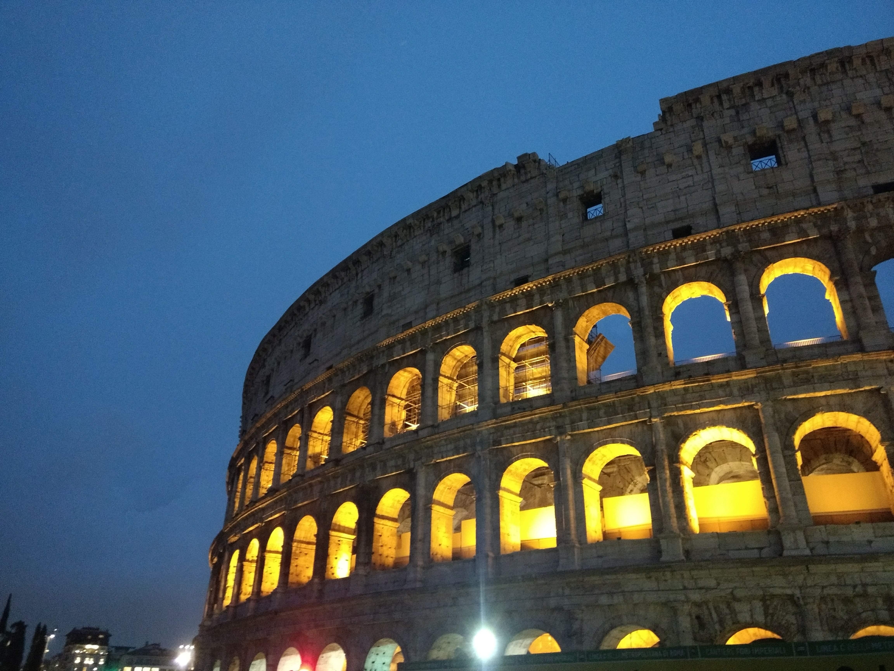

# genimg

This is a small project to create some artistic images.
Starting from a high resolution image, an approximation using triangles is estimated.

## Usage

`./genimg.py --help` should produce the following help:

```
usage: genimg.py [-h] [--cpu_count CPU_COUNT] [--num_shapes NUM_SHAPES]
                 [--output_file OUTPUT_FILE]
                 image

image generator

positional arguments:
  image                 image to process

optional arguments:
  -h, --help            show this help message and exit
  --cpu_count CPU_COUNT
                        thread/cpu count (default: 8)
  --num_shapes NUM_SHAPES
                        number of used shapes (default: 20000)
  --output_file OUTPUT_FILE
                        generated resulting image (default: image.svg)

stg7 2019
```

You can just use one of the provided example images and run the following command:

```bash
./genimg.py example_images/rome.jpg
```
It will use the following images


to create a generated SVG depending on the number of iterations, similar to this:


## Licence
See [LICENCE.md](LICENCE.md)